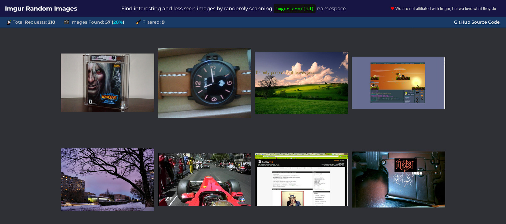

## Find Random Images on Imgur


A simple web-app that finds random images on Imgur.com,
and displays them in a typical grid layout with infinite scrolling.

It works by rapidly scanning `imgur.com/{id}` namespace - where `{id}`
is a randomly generated 5-character alphanumeric string - and checks to see if an image exists for that particular ID.

The entire application is a single `index.html` file with some
plain old Javascript on top of it - zero frameworks. Everything is compiled using esbuild.

## :star: Demo

- https://imgur-random.netlify.app/



## :computer: Development

Make sure you have Node.js installed on your system.

Then, clone this repo and run these commands:

```shell
git clone https://github.com/Athlon1600/imgur-random.git
cd imgur-random
npm install
npm run dev
```

This will start a local dev server at:

- http://127.0.0.1:8080/

with "live reload" in place, so any changes you make to js/css files,
those changes will be reflected immediately without needing to reload the page each time.

## 🚀 Deployment

Build this app for production by running:

```shell
npm run build
```

that will generate all the files that you need, and copy them in the `./public` directory.

Now you can copy the contents of the `./public` directory to any web-server
that is capable of serving static files - and you are done!

Demo version of this app is hosted on **Netlify** - all for free.
You can do the same by following these steps:

- create an account on Netlify
- add a new site (or Project)
- find your "Site ID" (or "Project ID)
- create a new token (https://app.netlify.com/user/applications#personal-access-tokens)

Once you have those two values, go to `package.json` of this project to find this line:

```shell
npx netlify deploy --site $NETLIFY_SITE_ID --auth $NETLIFY_AUTH_TOKEN --prod --dir=./public
```

replace those two variables for `--site` and `--auth` with your own site id and token,
and then run that command yourself.

## To-Do List

- Implement client side AI capable of classifying random images, allowing us to apply additional filters during
  searching.
